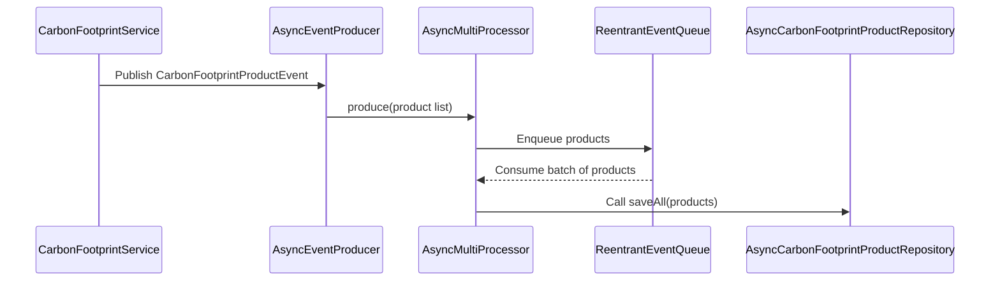

# 친환경 소비를 위한 탄소 배출량 최소화 시스템 Lettuce


## 1. 프로젝트 선정 배경 및 목표

저는 2025년 1월 지난달에 해카톤에서 UN에서 선정한 Sustainable Development Goals(SDGs) 중 9번 Industry, Innovation and Infrastructure와 13번 Climate Action에 대해 프로젝트를 진행하였습니다.

프로젝트는 유저의 친환경 소비 형태를 분석하여 탄소 배출량을 측정한다음 보상으로 포인트를 지급하여 유저는 지급 받은 포인트로 농부들로 부터 surpluse food를 구매할수 있는 플랫폼을 구현하였습니다.


그떄 당시 개발을 저 혼자 맡아 진행하였는데 24시간이라는 시간 제약 조건속에서 발표 전까지는 백엔드와 프론트를 모두 담을수 없다고 판단하여 flutter를 활용하여 외부 api를 연동해 모바일 어플리케이션 개발만 진행을 완료하였습니다.

해카톤은 끝났지만 그떄 만든 프로젝트의 아쉬움이 남은 저는 이 프로젝트를 백엔드 영역에서 완성하고자 합니다.

## 2. 아키텍처 개요

Lettuce는 도메인 주도 설계(DDD) 원칙을 기반으로 아래와 같이 계층을 분리하여 설계되었습니다.

도메인 (Domain):
핵심 비즈니스 로직과 도메인 모델(예: CarbonFootprint, 사용자 프로필 등)을 포함합니다.

애플리케이션 (Application):
도메인 간의 상호작용, 서비스 오케스트레이션, 이벤트 처리 흐름을 관리합니다.

인프라스트럭처 (Infrastructure):
데이터베이스 접근, 외부 API 연동(S3, 캐시 등), 비동기 이벤트 큐, 그리고 배치 처리 로직을 구현합니다.

글로벌 공유 (Global Shared):
공통 설정, 예외 처리, 공통 응답 포맷, 그리고 AOP 기반 기능(예: Rate Limiting) 등을 포함합니다.
아래 그림은 Lettuce의 주요 구성 요소 간 관계를 간략하게 나타냅니다.

## 3. 기술 선택

### 1. 데이터베이스

Java Spring에서 데이터베이스 접근 기술로 가장 많이 사용되는 기술은 JDBCTemplate, MyBatis, JPA 등이 있습니다.
JDBCTemplate는 가장 직관적인 데이터베이스 접근 방식이며 명확한 성능제어의 장점이 있지만 코드 재사용 어려움과 ORM의 장점을 사용할 수 없습니다.
MyBatis는 쿼리 재사용 쉬움이 간편하지만 비동기 처리 어려움과 코드 재사용 어려움이 있습니다.
JPA는 코드 재사용 쉬움과 쿼리 재사용 쉬움을 지원하지만 성능제어 어려움이 있습니다.



저는 성능이 크리티컬한 곳에서는 JDBCTemplate를 사용하고 그렇지 않은 곳에서는 JPA를 사용하여 편의성과 성능 사이에 밸런스를 잡았습니다.

캐싱은 데이터베이스 조회 성능을 향상시키는 중요한 기술입니다. 대체적으로 단일 서버에 적합한 스프링에서 기본적으로 제공하는 인메모리 캐싱 그리고 분산 시스템에서 사용되는 레디스 캐싱 기술이 있는데 현재 프로젝트는 AWS EC2 하나의 인스턴스에서 돌아가기 때문에 인메모리 캐싱을 사용하였습니다.

### 2. 테스트 환경 선택 JMeter & Lambda

시스템이 실제로 얼마나 많은 데이터를 처리할 수 있는지 테스트하기 위한 환경을 구축했습니다. 단순히 처리량을 측정하는 것뿐만 아니라, 부하 상태에서 시스템이 어떤 한계에 도달하는지가 주요 포인트였습니다. 이 과정에서 Nginx, Spring, MySQL 각 컴포넌트가 어떻게 성능을 발휘하는지 확인하기 위해 다양한 부하 조건을 적용했습니다.

Nginx: 부하가 몰릴 때 얼마나 많은 요청을 안정적으로 전달할 수 있는가?
Spring 서버: 트래픽이 증가할 때 서버가 정상적으로 응답하고, 처리량이 얼마나 되는가?
MySQL: 대량의 로그 데이터를 처리하면서, DB가 어느 시점에서 병목 현상이 발생하는지?

프로젝트가 실제로 배포된후를 고려했을떄 사용자 100만명이 있는 서비스 앱이 있을때 100만개의 서로 다른 인스턴스에서 요청이 들어오는데 다수의 인스턴스에서 동시에 요청이 들어왔을떄도 시스템이 안정적으로 동작하는지 확인하기 위해 테스트 환경을 구축했습니다.

두가지 테스트 방식을 택하였는데 첫번째는 JMeter를 사용하여 로컬 환경에서 부하를 주는 방식이고 두번째는 AWS Lambda를 사용하여 클라우드 환경에서 부하를 주는 방식입니다.

비교적 EC2보다 확장이 용이하고 비용적 이점이 큰 AWS Lambda를 사용했습니다.
Node.js 기반의 Lambda 테스트 환경을 만들었고, 인스턴스 400개를 동시에 실행해 서버에 요청을 보냈습니다. 이 테스트를 통해 동시 요청 시 어떻게 서버가 반응하는지, 어디서 병목이 발생하는지 확인할 수 있었습니다. 

## 4. 트러블 슈팅

### 1. 비동기 큐에서의 성능 저하

문제 상황

- 이슈: 대량의 이벤트가 짧은 시간에 몰리면 단일 큐(ReentrantEventQueue)에 모든 이벤트가 집중되고, 큐 내부에서는
  ReentrantLock을 통한 잠금 경쟁(lock contention)이 발생하여 이벤트 소비(consume) 및 처리 지연이 심화되었습니다.
- 증상: TPS(초당 처리량)가 예상보다 낮아지고, 큐에 남은 잔여 이벤트들이 일정 시간 이상 대기하는 현상이 발견되었습니다.

원인 분석

- 큐의 produce() 메서드에서 queue.addAll()을 호출할 때마다 내부적으로 각각의 이벤트마다 잠금을 획득하므로 다수의 스레드가 동시에 접근할 경우
  잠금 경합이 과도하게 발생함.

해결 방안

- 다중 큐 분산:
  단일 큐 대신 AsyncMultiProcessor를 도입하여 여러 개의 큐로 이벤트를 분산시켰습니다.
  각 큐는 독립적으로 소비되며, 큐 선택은 랜덤 혹은 해시 기반으로 분산 처리하여 잠금 경쟁을 완화했습니다.
- 리더-워커 패턴 적용:
  각 큐마다 리더 스레드가 지속적으로 consume() 동작을 수행하고,
  소비된 이벤트들은 별도의 워커 스레드 풀로 전달되어 저장(혹은 후속 처리)하도록 변경하였습니다.
- 타임아웃 기반 소비:
  Bulk 사이즈에 도달하지 않아도 일정 타임아웃 후 잔여 이벤트를 강제로 처리하도록 개선하였습니다.
  이를 통해 이벤트 처리가 과도하게 지연되는 상황을 방지했습니다.
  아래는 AsyncMultiProcessor의 일부 핵심 로직 예시입니다:

```java
private void setup(int queueCount, Long timeout, Integer bulkSize, int poolSize) {
    IntStream.range(0, queueCount).forEach(i -> {
        ReentrantEventQueue<E> queue = objectProvider.getObject(timeout, bulkSize);
        queues.add(queue);

        // 각 큐마다 전용 리더와 캐싱(executor) 스레드 할당
        ExecutorService leaderExecutor = Executors.newFixedThreadPool(poolSize);
        leaderExecutors.add(leaderExecutor);
        flattenerExecutors.add(Executors.newCachedThreadPool());

        startQueueProcessor(queue, leaderExecutor);
    });
}

private void startQueueProcessor(ReentrantEventQueue<E> queue, ExecutorService executor) {
    CompletableFuture.runAsync(() -> {
        while (!Thread.currentThread().isInterrupted()) {
            try {
                List<E> elements = queue.consume();
                executor.execute(() -> saveFunction.accept(elements));
            } catch (Exception e) {
                log.error("Error processing queue: ", e);
            }
        }
    });
}
```

> 결과: 다중 큐 분산 및 리더-워커 패턴 도입 후, 전체 TPS가 50% 이상 개선되었으며 이벤트 대기 시간도 크게 단축되었습니다.

---

### 2. DB 커넥션 풀 부족 문제

문제 상황

- 이슈: Bulk Insert를 수행하는 도중 DB에 동시에 접근하는 요청이 몰리면서 HikariDataSource의 최대 커넥션 풀 한계를 초과하는 경우가 발생했습니다.
- 증상: 특정 시점 부터 DB에 이벤트 저장 요청이 지연되어, 이벤트 누적으로 인한 데이터 처리 실패 및 타임아웃 오류 발생.

원인 분석

- Bulk 처리 시 동시에 다수의 큐에서 이벤트를 저장하려 할 때, DB 커넥션 입장에서 연결 부족 현상이 발생함.
- 초기 스레드 풀 설정 값이 DB 최대 커넥션 풀과 맞지 않아, 각 큐에서 생성하는 리더 스레드의 수가 과도하게 많았음.

해결 방안

- 동적 스레드 풀 크기 산출:
  HikariDataSource의 최대 커넥션 수를 읽어와 calculatePoolSize() 메서드에서 적정 워커 스레드 수를 산출하도록 변경하였습니다.
- Bulk Insert 최적화:
  Bulk Insert 시, 각 배치당 이벤트 수를 최적화하고 타임아웃 값을 적용하여 데이터베이스 쪽 부하를 분산하도록 개선했습니다.
  아래는 동적 스레드 풀 계산 예시입니다:

```java
private static int calculatePoolSize(JdbcTemplate jdbcTemplate) {
    DataSource dataSource = jdbcTemplate.getDataSource();
    if (!(dataSource instanceof HikariDataSource hikariDataSource)) {
        throw new IllegalArgumentException("DataSource must be HikariDataSource");
    }
    int maxPoolSize = hikariDataSource.getMaximumPoolSize();
    int calculatedSize = maxPoolSize * POOL_SIZE_RATIO / 10;
    log.debug("Creating AsyncMultiProcessor with pool size: {}", calculatedSize);
    return calculatedSize;
}
```

> 결과: 동적 스레드 풀 크기 산출 및 Bulk Insert 최적화 적용 후, DB 커넥션 부족 문제가 크게 개선되었습니다.

---

### 3. API 엔드포인트 Rate Limiting 이슈

문제 상황

- 이슈: 로그인과 같이 중요한 API 엔드포인트에 대해 단기간에 과도한 요청이 들어오면서, 서비스 품질이 저하되는 문제가 발생했습니다.
- 증상: 특정 사용자의 요청 혹은 시스템 전반에서 Rate Limit에 걸려 정상 요청이 거부되는 현상 발생.

원인 분석

- RateLimited 애노테이션을 적용한 엔드포인트에서, 요청에 대한 소비 토큰 로직이 과도한 요청으로 인해 버킷(bucket)이 소진되는 경우가 발생함.

해결 방안

- Bucket4j 기반의 Rate Limiting:
  AOP 기반의 RateLimitAspect에 Bucket4j를 도입하여, 각 요청에 대해 동적으로 토큰 소비를 관리하도록 재설계하였습니다.
- 로그인 API에 특화된 후처리:
  로그인 성공 후 해당 사용자의 Rate Limit bucket을 초기화하여, 정상 로그인 경우 불필요한 토큰 소비를 방지하도록 처리했습니다.
  아래는 핵심 Aspect 로직 일부입니다:

```java
@Around("@annotation(com.example.lettuce.global.framework.annotation.RateLimited)")
public Object around(ProceedingJoinPoint joinPoint) throws Throwable {
    RateLimited rateLimited = getRateLimited(joinPoint);
    String key = resolveKey(joinPoint, rateLimited);
    if (rateLimited.type() != RateLimitType.USER && !tryConsume(key, rateLimited.type())) {
        throw new BaseException(ErrorCode.TOO_MANY_REQUESTS);
    }
    return joinPoint.proceed();
}
```

> 결과: 로그인 API에 대한 Rate Limit 적용 후, 과도한 요청으로 인한 서비스 지연 및 부하 문제가 크게 개선되었습니다.

---
